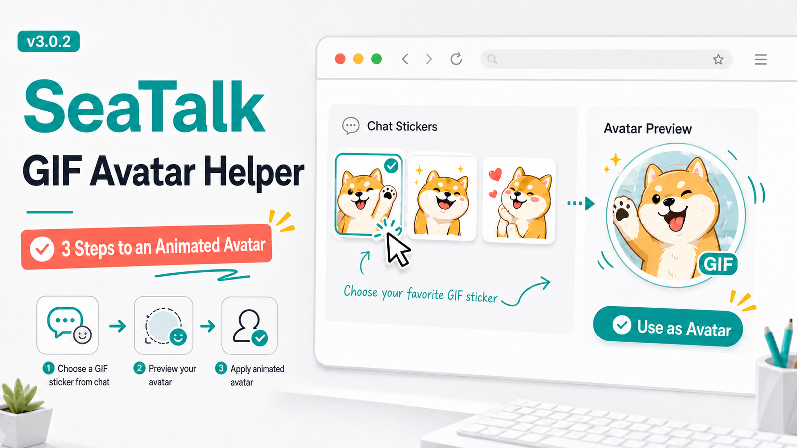
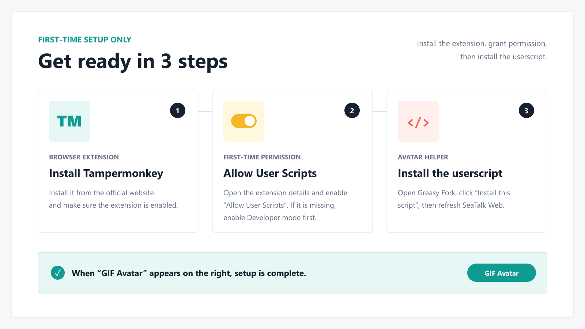

  

  <strong>Turn a GIF sticker from your SeaTalk chat into an animated personal avatar. No bundle search or DevTools breakpoint required.</strong>

  <a href="https://greasyfork.org/en/scripts/588931">Install userscript</a>
  ·
  <a href="https://seatalkweb.com/">Open SeaTalk Web</a>
  ·
  <a href="https://github.com/Candle-Git/seatalk-personal-gif-avatar-helper/issues">Report an issue</a>
  ·
  <a href="README.md">中文</a>

## First-time setup: only 3 steps

> The extension, permission, and userscript only need to be set up once. After that, open the helper whenever you want to change your GIF avatar.

1. **Install Tampermonkey**: Open the [official Tampermonkey website](https://www.tampermonkey.net/) in Chrome or Edge, then install and enable the extension.

2. **Enable “Allow User Scripts”**: Open `chrome://extensions` or `edge://extensions`, select Tampermonkey **Details**, and enable **Allow User Scripts**.

3. **Install GIF Avatar Helper**: Open the [Greasy Fork script page](https://greasyfork.org/en/scripts/588931), click **Install this script**, then refresh [SeaTalk Web](https://seatalkweb.com/).

> [!IMPORTANT]
> Setup is complete only when the **GIF Avatar** button appears on the right side of SeaTalk.

<strong>“Allow User Scripts” is missing</strong>

1. Open `chrome://extensions` or `edge://extensions`.
2. Enable **Developer mode** in the top-right corner.
3. Find Tampermonkey and open **Details**.
4. Enable **Allow User Scripts**.
5. Return to SeaTalk and refresh the page.

## Start using it

### Quick try without your own GIF

1. Sign in to [SeaTalk Web](https://seatalkweb.com/).
2. Click **GIF Avatar** on the right.
3. Click **Try a random GIF avatar**.

### Use your own GIF

1. Send the GIF through SeaTalk's **sticker** button in the current chat. Do not upload it as a regular image file.
2. Open **GIF Avatar** and click **Capture GIFs from this chat**.
3. Select a sticker and click **Use this GIF as my avatar**.

The helper shows a confirmation as soon as the SeaTalk API accepts the update. If the visible avatar is briefly cached, refresh the page once.

## Features

- Try a random built-in GIF immediately after installation.
- Capture the 3 most recent SeaTalk GIF stickers from the current chat.
- Ignore unsupported regular GIF image files automatically.
- Discover the current `chunk-styles-*.js` and avatar update entry point.
- Wait automatically when SeaTalk is still loading.
- Drag the helper button and restore its saved position.
- Chinese and English interface.
- Stage-by-stage diagnostics and API success confirmation.

## Privacy and safety

- Runs only on `seatalkweb.com`.
- Does not collect or upload account details, chat content, passwords, cookies, or other personal information.
- Includes no separate analytics or tracking service.
- Uses only the personal avatar update capability already available in the current SeaTalk page.
- Modifies only the current user's avatar.
- Preferences such as language and button position stay in Tampermonkey local storage.

## FAQ

<strong>The GIF Avatar button does not appear</strong>

Make sure Tampermonkey and this userscript are both enabled. Confirm that **Allow User Scripts** is enabled, then refresh SeaTalk.

<strong>The update succeeded, but the old avatar is still visible</strong>

This is usually a SeaTalk page cache. Refresh the page and check again.

<strong>The avatar update entry point cannot be found</strong>

Allow the automatic check to run for 5 seconds. If it still fails, click **Check again and apply** or refresh SeaTalk. If the problem continues, expand **Status and diagnostics**, keep a screenshot, and report it through [GitHub Issues](https://github.com/Candle-Git/seatalk-personal-gif-avatar-helper/issues).

<strong>The GIF I just sent was not captured</strong>

Make sure you sent it through SeaTalk's **sticker** button instead of uploading it as a regular image. The helper checks only the currently open chat.

<strong>The helper button covers a SeaTalk control</strong>

Drag the **GIF Avatar** button somewhere else. The script saves the new position.

## Updates and feedback

- Tampermonkey checks Greasy Fork for script updates. You can also check manually in its dashboard.
- See [CHANGELOG.md](CHANGELOG.md) for the full version history.
- Include reproduction steps and helper diagnostics when reporting a problem.
- Never post passwords, cookies, work chat content, or other sensitive information in a public issue.

## Notes

- Current version: `3.0.2`
- Supported page: SeaTalk Web
- This is an unofficial helper and is not affiliated with, endorsed by, or maintained by SeaTalk.
- A future SeaTalk frontend update may temporarily affect compatibility. Check the diagnostics panel for details.

Made by Yixin.Zhong × Codex

