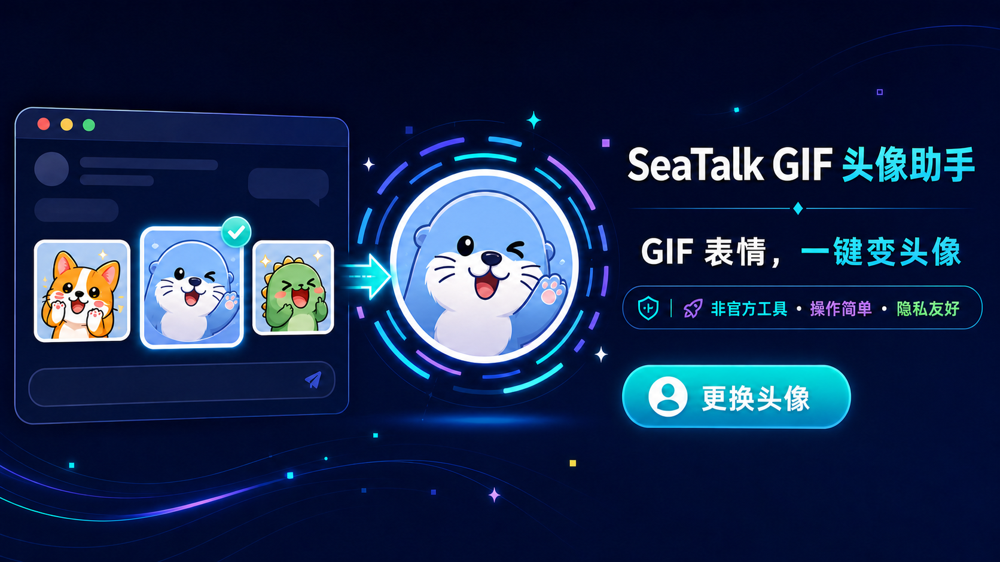
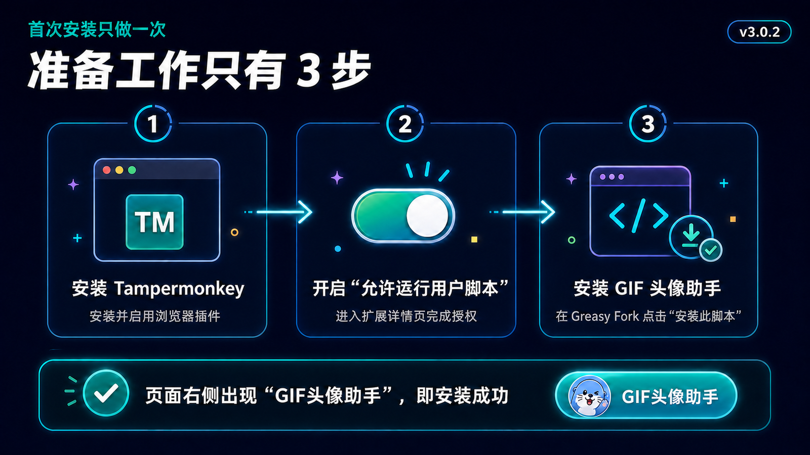
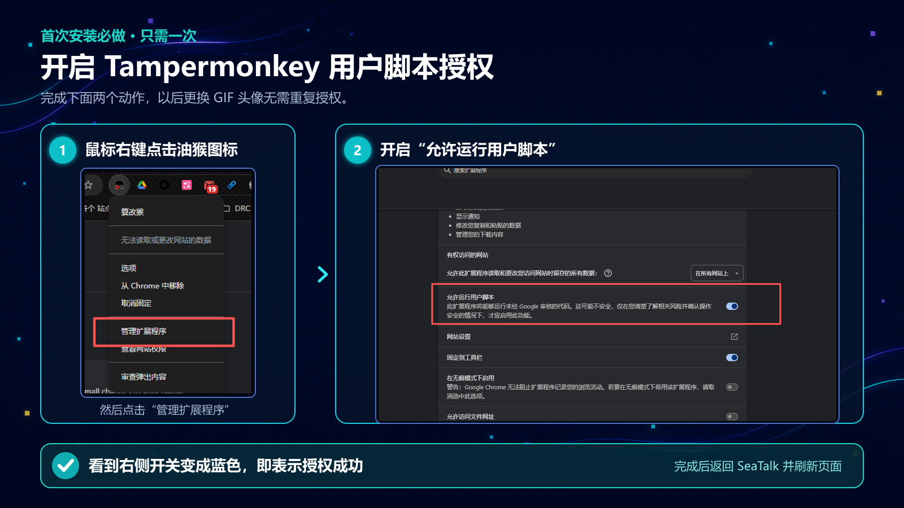

  

  <strong>把聊天里的 GIF 表情变成 SeaTalk 个人动态头像，不需要找前端文件，也不需要设置断点。</strong>

  <a href="https://greasyfork.org/zh-CN/scripts/588931">安装脚本</a>
  ·
  <a href="https://seatalkweb.com/">打开 SeaTalk Web</a>
  ·
  <a href="https://github.com/Candle-Git/seatalk-personal-gif-avatar-helper/issues">反馈问题</a>
  ·
  <a href="README.en.md">English</a>

## 首次安装：只需 3 步

> 安装插件、开启授权、安装脚本只需要做一次。以后更换 GIF 头像时，直接打开助手即可。

1. **安装 Tampermonkey**：使用 Chrome 或 Edge 打开 [Tampermonkey 官方网站](https://www.tampermonkey.net/)，安装并启用浏览器插件。

2. **首次授权：开启“允许运行用户脚本”**：用鼠标右键点击浏览器右上角的 Tampermonkey（油猴）图标，点击 **管理扩展程序**，再开启 **允许运行用户脚本**。

3. **安装 GIF 头像助手**：打开 [Greasy Fork 脚本页面](https://greasyfork.org/zh-CN/scripts/588931)，点击 **安装此脚本**，然后刷新 [SeaTalk Web](https://seatalkweb.com/)。

> [!IMPORTANT]
> SeaTalk 页面右侧出现“GIF头像助手”按钮，才表示插件、授权和脚本都已准备完成。

### 首次授权详图（只需一次）

> [!WARNING]
> 请使用 **鼠标右键** 点击浏览器右上角的 Tampermonkey（油猴）图标。没有完成这次授权时，脚本即使显示已安装，也不会在 SeaTalk 页面运行。

<strong>没有看到“允许运行用户脚本”选项？点这里展开</strong>

1. 用鼠标右键点击浏览器右上角的 Tampermonkey（油猴）图标。
2. 点击 **管理扩展程序**。
3. 在扩展详情页开启 **允许运行用户脚本**（Allow User Scripts）。
4. 如果没有这个选项，打开 `chrome://extensions` 或 `edge://extensions`，在扩展页右上角开启 **开发者模式**。
5. 回到 SeaTalk 并刷新页面。

## 开始使用

### 没有准备 GIF：随机体验

1. 登录 [SeaTalk Web](https://seatalkweb.com/)。
2. 点击页面右侧的 **GIF头像助手**。
3. 点击 **随机换一个 GIF 头像**。

### 使用自己的 GIF

1. 在当前聊天窗口通过 **表情** 按钮发送想用的 GIF 表情。不要把 GIF 当作普通图片文件拖入聊天。
2. 打开 **GIF头像助手**，点击 **抓取当前聊天最近的 GIF**。
3. 选择喜欢的表情，点击 **换成这个 GIF 头像**。

SeaTalk 接口确认成功后，助手会立即显示成功提醒。页面头像如果暂时没有变化，刷新一次即可。

## 主要功能

- 随机应用内置 GIF，安装后可以立即体验。
- 抓取个人私聊、群聊和聊天分支中最近的 3 个 SeaTalk GIF 表情。
- 读取候选图片的真实帧数，双帧 GIF 也能识别，并自动过滤静态图片。
- 按聊天先后顺序展示结果，不再让尺寸较大的旧图片挤掉新图片。
- 正常消息即使带有 Reaction、emoji 或 emoticon 结构，也不会被错误忽略。
- 自动查找当前 `chunk-styles-*.js` 和头像更新入口。
- SeaTalk 加载较慢时自动等待，无需重复点击。
- 浮动按钮可以拖动，并记住上次位置。
- 支持中文和英文界面。
- 提供分阶段诊断和接口成功确认。
- 助手底部显示脚本版本号，方便截图报障；新版本首次运行时会显示一次更新提示。

## 隐私与安全

- 界面只在 `seatalkweb.com` 页面运行。
- 仅在用户主动抓取时读取 `f.haiserve.com` 上的候选图片数据，用于确认图片是否真的包含两帧或以上。
- 不收集或上传账号、聊天内容、密码、Cookie 等个人信息。
- 不包含独立统计或用户追踪服务。
- 只调用当前 SeaTalk 页面已有的个人头像更新能力。
- 只修改当前用户自己的头像。
- 语言和按钮位置等偏好只保存在 Tampermonkey 本地存储中。
- 不把带签名参数的候选图片地址写入本地设置、调试信息或公开文档。

## 常见问题

<strong>安装后没有看到“GIF头像助手”按钮</strong>

确认 Tampermonkey 和本脚本都已启用，并检查是否开启了 **允许运行用户脚本**。完成后刷新 SeaTalk。

<strong>提示成功，但页面仍显示旧头像</strong>

通常是 SeaTalk 页面缓存。刷新页面后再查看即可。

<strong>提示找不到头像更新入口</strong>

等待自动检查运行 5 秒。如果仍失败，点击 **重新检查并应用** 或刷新 SeaTalk。持续失败时，请展开助手里的“运行状态与调试信息”，保留截图并通过 [GitHub Issues](https://github.com/Candle-Git/seatalk-personal-gif-avatar-helper/issues) 反馈。

<strong>抓取不到刚发送的 GIF</strong>

请确认 GIF 是通过 SeaTalk 的 **表情** 按钮发送，而不是作为普通图片文件上传。助手只检查当前打开且已经显示出来的聊天内容。抓取时会读取候选图片并确认真实帧数，因此可能需要等待几秒。

如果仍然抓不到，请展开“运行状态与调试信息”，截图时保留助手底部的版本号，但务必遮挡聊天内容、姓名和图片地址中的参数。

<strong>按钮挡住 SeaTalk 操作区域</strong>

按住“GIF头像助手”按钮拖到其他位置即可。脚本会保存新位置。

## 更新与反馈

- Tampermonkey 会从 Greasy Fork 检查脚本更新，也可以在管理面板中手动检查。
- 完整版本记录见 [CHANGELOG.md](CHANGELOG.md)。
- 报告问题时请提供复现步骤、助手底部版本号和匿名化后的诊断信息。
- 请勿在公开 Issue 中上传密码、Cookie、工作聊天内容或其他敏感信息。

## 说明

- 当前版本：`3.0.3`
- 适用页面：SeaTalk Web
- 本项目为非官方辅助工具，与 SeaTalk 官方无隶属、合作或认可关系。
- SeaTalk 前端更新可能暂时影响脚本兼容性，请以诊断面板提示为准。

Yixin.Zhong × Codex 制作

